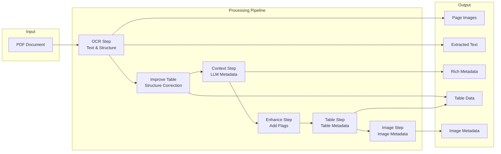

# Complex PDF RAG

**Advanced PDF processing pipeline for Retrieval-Augmented Generation (RAG) applications**

[](https://www.python.org/downloads/)
[](LICENSE)

A comprehensive PDF processing pipeline that extracts structured data from complex PDFs, including OCR text, tables, images, and rich context-aware metadata using Large Language Models (LLMs). Designed for building high-quality RAG systems that can understand and retrieve information from technical manuals, service documents, and other complex PDF documents.

---

## Table of Contents

- [Features](#features)
- [Architecture](#architecture)
- [Installation](#installation)
- [Quick Start](#quick-start)
- [Configuration](#configuration)
- [Pipeline Steps](#pipeline-steps)
- [Output Structure](#output-structure)
- [Supported LLM Providers](#supported-llm-providers)
- [Cost Tracking](#cost-tracking)
- [Examples](#examples)
- [Contributing](#contributing)
- [License](#license)

---

## Features

- **Advanced OCR Extraction**: Uses Docling and EasyOCR for high-quality text extraction with table structure detection
- **Context-Aware Metadata**: Generates rich metadata using LLM vision models with multi-page context analysis (n-1, n, n+1 pages)
- **Table Processing**: Extracts and structures table data with detailed metadata
- **Image Extraction**: Captures page images and embedded figures
- **Cost Tracking**: Built-in cost tracking for all LLM API calls
- **Flexible Pipeline**: Run individual steps or the complete pipeline
- **Skip Logic**: Automatically skips already-processed pages to save time and costs
- **Multi-Provider Support**: Works with OpenAI, Anthropic, Google, Azure, and more via LiteLLM

---

## Architecture

The pipeline processes PDFs through six sequential steps:



### Pipeline Flow

1. **OCR Step**: Extracts text, tables, and images from PDF pages using Docling
2. **Improve Table Step**: Uses LLM vision to visually analyze table images and correct HTML structure for pixel-perfect matching
3. **Context Step**: Generates rich metadata using LLM vision models with surrounding page context
4. **Enhance Step**: Adds structural flags (has_tables, has_figures) to metadata
5. **Table Step**: Generates detailed metadata for extracted tables (uses corrected HTML from step 2)
6. **Image Step**: Generates detailed metadata for images and diagrams, including classification and natural descriptions

---

## Installation

### Prerequisites

- Python 3.11 or higher
- [uv](https://github.com/astral-sh/uv) package manager (recommended) or pip

### Step 1: Clone the Repository

```bash
git clone <repository-url>
cd complex-pdf-rag
```

### Step 2: Install Dependencies

Using `uv` (recommended):

```bash
uv sync
```

Or using `pip`:

```bash
pip install -e .
```

### Step 3: Set Up Environment Variables

Set the API key for your chosen LLM provider:

**OpenAI:**
```bash
export OPENAI_API_KEY="your-api-key-here"
```

**Anthropic:**
```bash
export ANTHROPIC_API_KEY="your-api-key-here"
```

**Google:**
```bash
export GOOGLE_API_KEY="your-api-key-here"
```

**Azure OpenAI:**
```bash
export AZURE_OPENAI_KEY="your-api-key-here"
export AZURE_OPENAI_ENDPOINT="https://your-endpoint.openai.azure.com"
export AZURE_OPENAI_API_VERSION="2024-02-15-preview"
```

For other providers, see the [LiteLLM documentation](https://docs.litellm.ai/docs/providers).

---

## Quick Start

### Basic Usage

```python
from pathlib import Path
from complex_pdf.config.pipeline_config import PipelineConfig
from complex_pdf.pipeline import PDFProcessor

# Configure the pipeline
config = PipelineConfig(
    pdf_path=Path("data/your_document.pdf"),
    output_dir=Path("output"),
    model_name="openai/gpt-4o",  # or "anthropic/claude-3-opus", etc.
    skip_ocr_if_exists=True,
    skip_metadata_if_exists=True,
)

# Create processor and run pipeline
processor = PDFProcessor(config)
results = processor.run()
```

### Running Individual Steps

You can run specific steps instead of the full pipeline:

```python
# Run only OCR extraction
results = processor.run(steps=["ocr"])

# Run OCR and table structure improvement
results = processor.run(steps=["ocr", "improve_table"])

# Run OCR, improve tables, and context extraction
results = processor.run(steps=["ocr", "improve_table", "context"])

# Run all steps
results = processor.run()  # or processor.run(steps=["ocr", "improve_table", "context", "enhance", "table", "image"])
```

### Command Line Usage

```bash
python main.py
```

---

## Try It Out

### Sample PDF Included

This repository includes a sample PDF file (`data/short_complex_manual.pdf`) - a 38-page JLG service manual that demonstrates the pipeline's capabilities. This technical manual contains:
- Complex tables with merged cells and special formatting
- Technical diagrams and images
- Multi-page sections with cross-references
- Structured metadata (document ID, revision, model numbers)

### Running the Demo

The `main.py` file is pre-configured to process the sample PDF. Simply run:

```bash
python main.py
```

**Note:** By default, `main.py` is configured with `max_pages=6` to process only the first 6 pages for quick testing. To process all pages or use your own PDF, modify the configuration in `main.py`:

```python
config = PipelineConfig(
    pdf_path=Path("data/short_complex_manual.pdf"),  # Change to your PDF
    output_dir=Path("output"),
    model_name="openai/gpt-4o",
    skip_ocr_if_exists=True,
    skip_metadata_if_exists=True,
    max_pages=None,  # Set to None to process all pages, or a number to limit
)
```

### Pre-Generated Output

The `output/short_complex_manual/` directory contains pre-generated output for all 38 pages of the sample PDF. Each page has its own folder with the following structure:

```
output/short_complex_manual/
  page_1/
    page_1_full.png              # Full page screenshot
    metadata_page_1.json         # Basic page metadata
    context_metadata_page_1.json  # Rich LLM-generated metadata
    text/
      page_1_text.txt            # Extracted OCR text
    images/
      image-1-1.png              # Extracted images/figures
      image-1-2.png
    tables/
      table-1-1.html             # Extracted table HTML (corrected)
      table-1-1.png              # Table screenshot
  page_2/
    ...
  ...
```

**Output Files Explained:**
- **`page_N_full.png`**: Full-page screenshot of the original PDF page
- **`text/page_N_text.txt`**: Extracted text content from OCR
- **`tables/table-N-M.html`**: Structured HTML representation of tables (corrected by the improve_table step)
- **`tables/table-N-M.png`**: Screenshot of the table for visual reference
- **`images/image-N-M.png`**: Extracted images, diagrams, and figures from the page
- **`metadata_page_N.json`**: Basic metadata extracted during OCR (page number, dimensions, etc.)
- **`context_metadata_page_N.json`**: Rich, context-aware metadata generated by LLM vision models, including:
  - Document metadata (title, ID, revision, manufacturer, models)
  - Page visual descriptions
  - Section and subsection information
  - Content elements with summaries, keywords, and entities
  - Table metadata (structure, content summaries, relationships)
  - Image metadata (classifications, descriptions, component types)
  - Cross-page relationships and context

### Exploring the Output

To get started exploring the output:

1. **View the Rich Metadata**: Open `output/short_complex_manual/page_1/context_metadata_page_1.json` to see an example of the comprehensive metadata generated by the pipeline. This file contains document-level information, page descriptions, and detailed content analysis.

2. **Check Page Images**: Open any `page_N_full.png` file to see the original PDF page as an image.

3. **Examine Tables**: Look at pages with tables (e.g., `page_5/`) to see how tables are extracted and structured. The HTML files contain the corrected table structure, while the PNG files show the visual representation.

4. **Review Image Metadata**: Pages with images (like `page_1/`) contain detailed image metadata in the `context_metadata_page_N.json` file, including classifications (image vs. diagram), natural language descriptions, and component information.

5. **Compare Different Pages**: Browse through different page folders to see how the pipeline handles various content types - cover pages, tables, diagrams, and text-heavy sections.

---

## Configuration

The `PipelineConfig` class accepts the following parameters:

| Parameter | Type | Default | Description |
|-----------|------|---------|-------------|
| `pdf_path` | `Path` | **Required** | Path to the input PDF file |
| `output_dir` | `Path` | **Required** | Directory where processed output will be saved |
| `model_name` | `str` | `"openai/gpt-4o"` | LLM model to use (see [Supported LLM Providers](#supported-llm-providers)) |
| `skip_ocr_if_exists` | `bool` | `True` | Skip OCR step if output directory already exists |
| `skip_metadata_if_exists` | `bool` | `True` | Skip metadata extraction if context metadata already exists |

### Example Configuration

```python
config = PipelineConfig(
    pdf_path=Path("data/service_manual.pdf"),
    output_dir=Path("output"),
    model_name="anthropic/claude-3-opus",
    skip_ocr_if_exists=True,  # Useful for re-running only metadata steps
    skip_metadata_if_exists=False,  # Force re-extraction of metadata
)
```

---

## Pipeline Steps

### Step 1: OCR Extraction (`ocr`)

Extracts text, tables, and images from PDF pages using Docling and EasyOCR.

**Output:**
- Page images (`page_N_full.png`)
- Extracted text files (`text/page_N_text.txt`)
- Table HTML files and images (in `tables/` directory: `table-N-M.html`, `table-N-M.png`)
- Extracted images (in `images/` directory)
- Basic metadata (`metadata_page_N.json`)

**Dependencies:** None (first step)

### Step 2: Improve Table Structure (`improve_table`)

Uses LLM vision models to visually analyze table images and correct the extracted HTML structure to achieve pixel-perfect visual matching. This step ensures that merged cells, empty cells, special characters, and table structure accurately reflect the original image.

**Output:**
- Corrected HTML table files (replaces original `table-N-M.html` files)

**Dependencies:** Requires OCR step to complete first

**Cost:** This step makes LLM API calls for each table found. Uses vision models which are more expensive than text-only models.

**Key Features:**
- Visual-first analysis of table images
- Corrects colspan/rowspan attributes to match visual merges
- Preserves duplicate values across columns as separate cells (unless visually merged)
- Fixes special characters, units, and formatting
- Ensures empty cells are properly represented

### Step 3: Context Metadata (`context`)

Generates rich, context-aware metadata using LLM vision models. Analyzes each page along with its previous and next pages (n-1, n, n+1) for better understanding.

**Output:**
- Context metadata (`context_metadata_page_N.json`) containing:
  - Document metadata (title, ID, revision, etc.)
  - Page visual description
  - Section information
  - Content elements with summaries, keywords, entities
  - Cross-page relationships
  - Model applicability

**Dependencies:** Requires OCR step to complete first

**Cost:** This step makes LLM API calls and incurs costs based on your provider's pricing.

### Step 4: Enhance Metadata (`enhance`)

Adds structural flags to context metadata, such as `has_tables` and `has_figures`, based on the presence of extracted elements.

**Output:**
- Enhanced context metadata files (updated in place)

**Dependencies:** Requires OCR and Context steps

### Step 5: Table Metadata (`table`)

Generates detailed metadata for all extracted tables, including structure, content summaries, and relationships. Uses the corrected HTML from the Improve Table Structure step.

**Output:**
- Enhanced context metadata with `table_metadata` array containing detailed table information

**Dependencies:** Requires OCR, Improve Table, Context, and Enhance steps

**Cost:** This step makes LLM API calls for each table found.

### Step 6: Image Metadata (`image`)

Generates detailed metadata for all extracted images and diagrams using LLM vision. Classifies images as "image" (photos, illustrations, logos) or "diagram" (technical drawings, schematics, flowcharts, exploded views, wiring diagrams). Extracts comprehensive natural language descriptions of visual content.

**Output:**
- Enhanced context metadata with `image_metadata` array containing:
  - Image classification (image/diagram)
  - Title and summary
  - Natural description (detailed visual description)
  - Keywords, entities, component types
  - Model applicability and application context
  - Relationships to tables and other content

**Dependencies:** Requires OCR, Context, and Enhance steps (needs has_figures flag)

**Cost:** This step makes LLM API calls for each image found. Uses vision models which are more expensive than text-only models.

**Key Features:**
- Direct image analysis (no improvement step needed)
- Automatic classification between images and diagrams
- Comprehensive natural language descriptions
- Context-aware metadata extraction using page text
- Relationship identification with tables and text

---

## Output Structure

The pipeline generates a structured output directory for each processed PDF:

```
output/
  document_name/
    page_1/
      page_1_full.png              # Full page image
      metadata_page_1.json         # Basic page metadata
      context_metadata_page_1.json # Rich context-aware metadata
      text/
        page_1_text.txt            # Extracted text
      images/
        image-1-1.png              # Extracted images/figures
        image-1-2.png
      tables/
        table-1-1.html            # Corrected table HTML (after improve_table step)
        table-1-1.png              # Table image
        table-1-2.html
        table-1-2.png
```

### Metadata Structure

The `context_metadata_page_N.json` file contains:

```json
{
  "document_metadata": {...},
  "page_number": "1",
  "page_image": "page_1_full.png",
  "page_visual_description": "...",
  "section": {...},
  "content_elements": [...],
  "has_tables": true,
  "has_figures": true,
  "table_metadata": [
    {
      "table_id": "table-1-1",
      "title": "...",
      "summary": "...",
      "keywords": [...],
      ...
    }
  ],
  "image_metadata": [
    {
      "image_id": "image-1-1",
      "image_file": "image-1-1.png",
      "image_type": "diagram",
      "title": "...",
      "summary": "...",
      "natural_description": "Detailed natural language description...",
      "keywords": [...],
      "entities": [...],
      "component_type": "...",
      "model_applicability": [...],
      "application_context": [...],
      "related_tables": [...]
    }
  ]
}
```

---

## Supported LLM Providers

The pipeline uses [LiteLLM](https://docs.litellm.ai/) to support multiple LLM providers. Set the appropriate environment variable for your chosen provider:

| Provider | Model Name Format | Environment Variable |
|----------|-------------------|---------------------|
| OpenAI | `openai/gpt-4o`, `openai/gpt-4-turbo` | `OPENAI_API_KEY` |
| Anthropic | `anthropic/claude-3-opus`, `anthropic/claude-3-sonnet` | `ANTHROPIC_API_KEY` |
| Google | `google/gemini-pro-vision` | `GOOGLE_API_KEY` |
| Azure OpenAI | `azure/gpt-4o` | `AZURE_OPENAI_KEY`, `AZURE_OPENAI_ENDPOINT`, `AZURE_OPENAI_API_VERSION` |
| Cohere | `cohere/command` | `COHERE_API_KEY` |
| Together AI | `together/...` | `TOGETHER_API_KEY` |

For a complete list of supported providers and models, see the [LiteLLM documentation](https://docs.litellm.ai/docs/providers).

### Model Selection

Choose a model based on your needs:

- **Vision Models Required**: The context and table steps require vision-capable models (e.g., `gpt-4o`, `claude-3-opus`, `gemini-pro-vision`)
- **Cost vs. Quality**: Larger models (e.g., `gpt-4o`, `claude-3-opus`) provide better results but cost more
- **Speed**: Faster models may sacrifice some accuracy

---

## Cost Tracking

The pipeline includes built-in cost tracking for all LLM API calls. After running the pipeline, you'll see a cost summary:

```
============================================================
Cost Summary
============================================================
Total Cost: $0.123456
Total Tokens: 125,000
  Prompt: 100,000 | Completion: 25,000
Total API Calls: 45

Cost Breakdown by Call Type:
  context_metadata: $0.100000 (100,000 tokens)
  table_metadata: $0.023456 (25,000 tokens)
```

### Accessing Cost Information Programmatically

```python
processor = PDFProcessor(config)
results = processor.run()

# Get cost summary
cost_summary = processor.llm_client.get_cost_summary()
print(f"Total Cost: ${cost_summary['total_cost']:.6f}")
print(f"Total Tokens: {cost_summary['total_tokens']:,}")
```

### Cost Optimization Tips

1. **Use Skip Flags**: Set `skip_ocr_if_exists=True` and `skip_metadata_if_exists=True` to avoid reprocessing
2. **Selective Steps**: Run only the steps you need (e.g., skip table metadata if not needed)
3. **Model Selection**: Use faster/cheaper models for development, premium models for production
4. **Batch Processing**: Process multiple PDFs in a single session to share the cost tracker

---

## Examples

### Example 1: Process a Service Manual

```python
from pathlib import Path
from complex_pdf.config.pipeline_config import PipelineConfig
from complex_pdf.pipeline import PDFProcessor

config = PipelineConfig(
    pdf_path=Path("data/service_manual.pdf"),
    output_dir=Path("output"),
    model_name="openai/gpt-4o",
)

processor = PDFProcessor(config)
results = processor.run()

# Check results
for step, result in results.items():
    print(f"{step}: {result.get('status')}")
```

### Example 2: Re-run Only Metadata Steps

If you've already run OCR but want to regenerate metadata with a different model:

```python
config = PipelineConfig(
    pdf_path=Path("data/service_manual.pdf"),
    output_dir=Path("output"),
    model_name="anthropic/claude-3-opus",
    skip_ocr_if_exists=True,  # Skip OCR, use existing output
    skip_metadata_if_exists=False,  # Regenerate metadata
)

processor = PDFProcessor(config)
results = processor.run(steps=["improve_table", "context", "enhance", "table", "image"])
```

### Example 3: Process Only Specific Pages

The pipeline processes all pages by default. To process specific pages, you can modify the step functions or use the pipeline programmatically with custom logic.

---

## Contributing

Contributions are welcome! Please feel free to submit a Pull Request. For major changes, please open an issue first to discuss what you would like to change.

### Development Setup

1. Clone the repository
2. Install dependencies: `uv sync`
3. Set up your environment variables
4. Make your changes
5. Test your changes
6. Submit a pull request

---

## License

This project is licensed under the MIT License - see the LICENSE file for details.

---

## Acknowledgments

- [Docling](https://github.com/DS4SD/docling) for PDF processing and OCR
- [EasyOCR](https://github.com/JaidedAI/EasyOCR) for OCR capabilities
- [LiteLLM](https://github.com/BerriAI/litellm) for unified LLM interface
- [PyMuPDF](https://github.com/pymupdf/PyMuPDF) for PDF manipulation

---

## Support

For issues, questions, or contributions, please open an issue on the GitHub repository.
